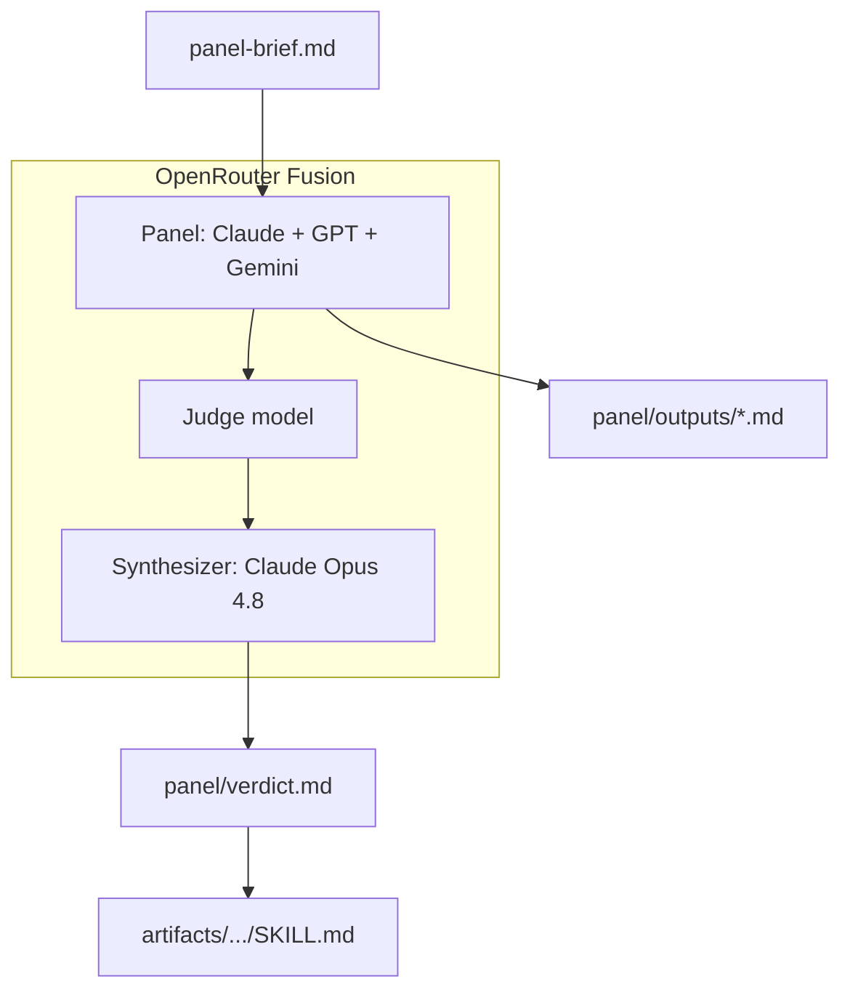

# Agent Council CX Sentiment Skill

**AI Agent Council POC:** stress-testing a SaaS support sentiment rubric with [OpenRouter Fusion](https://openrouter.ai/docs/guides/routing/routers/fusion-router).

Single-model review is one opinion — even when the model is the best in the world. This repository documents a proof-of-concept where the same expert-panel brief was sent to three frontier models in parallel (Claude Opus, GPT, Gemini Pro), a judge surfaced the structure of their disagreement, and a synthesizer merged the best ideas into a production-ready `SKILL.md`.

The canonical single-score sentiment design would rate a polite customer during a total production outage as **5/5** and route them away from retention. Every model on the council caught that flaw. The disagreement on *architecture* — while agreeing on the obvious — is the deliberation that earned the verdict.

---

## What this repo contains

| Path | Description |
|---|---|
| [`artifacts/support-sentiment-skill/SKILL.md`](artifacts/support-sentiment-skill/SKILL.md) | **Canonical deliverable** — synthesized v1.0 rubric (§1–§14) |
| [`panel/outputs/`](panel/outputs/) | Raw independent outputs from each panel model |
| [`panel/verdict.md`](panel/verdict.md) | Fusion synthesizer final verdict (critique + stress tests + merged SKILL.md) |
| [`panel/comparative-review.md`](panel/comparative-review.md) | Which model "won" and why |
| [`panel/production-roadmap.md`](panel/production-roadmap.md) | Phased plan to take the SKILL.md to production |
| [`prompts/panel-brief.md`](prompts/panel-brief.md) | Reproducible panel prompt |
| [`docs/article.md`](docs/article.md) | Full LinkedIn article draft |
| [`docs/linkedin-post.md`](docs/linkedin-post.md) | Short LinkedIn teaser |

---

## Architecture

**Flow:** panel → judge → synthesizer → verdict

1. **Panel** — same brief dispatched in parallel to Claude Opus Latest, OpenAI GPT Latest, Google Gemini Pro Latest
2. **Judge** — structured deliberation: consensus, contradictions, unique insights, blind spots
3. **Synthesizer** — Claude Opus 4.8 merges the best of each into a final artifact

---

## Key finding

All three models agreed on the headline flaw: canonical sentiment scoring **conflates emotional valence, satisfaction, business impact, and churn risk** into one number.

They disagreed on architecture — and that disagreement was the value:

| Criterion | Claude Opus | GPT Latest | Gemini Pro |
|---|---|---|---|
| Determinism | Strong | **Strongest** | Weak |
| Auditability | Strong | **Strongest** | Good |
| Governance (α target) | **Best** | Gap | Gap |
| Worked JSON examples | Few | **5 full** | Schema only |
| Brevity / elegance | Medium | Verbose | **Best** |

The final [`SKILL.md`](artifacts/support-sentiment-skill/SKILL.md) synthesizes GPT's precedence-and-caps scoring engine with Claude's governance scaffolding (Krippendorff's α ≥ 0.80, determinism controls) and Gemini's P1-outage baseline guardrail.

See [`panel/comparative-review.md`](panel/comparative-review.md) for the full analysis.

---

## The deliverable

The canonical artifact is [`artifacts/support-sentiment-skill/SKILL.md`](artifacts/support-sentiment-skill/SKILL.md).

> **Disclaimer:** This is a **v1.0 candidate, not production-validated**. It has never been tested against real ticket data. Before deploying, follow the phased plan in [`panel/production-roadmap.md`](panel/production-roadmap.md) — starting with building a stratified gold set of ~200 anonymized cases.

---

## How to reproduce

1. Copy the prompt from [`prompts/panel-brief.md`](prompts/panel-brief.md)
2. Run it through [OpenRouter Fusion](https://openrouter.ai/docs/guides/routing/routers/fusion-router) with at least three panel models
3. Add a judge step and synthesizer (see [`panel/README.md`](panel/README.md))
4. Optionally run the follow-up prompts for comparative review and production roadmap

---

## LinkedIn article

Full narrative, cost-conscious variant, and reproduction guide: [`docs/article.md`](docs/article.md)

---

## License

MIT — see [LICENSE](LICENSE).

---

## References

- [OpenRouter Fusion: Surpassing Frontier Performance](https://openrouter.ai/blog/announcements/fusion-beats-frontier/)
- [OpenRouter Fusion Router docs](https://openrouter.ai/docs/guides/routing/routers/fusion-router)
- [AI Agent Council skill (MCP Market)](https://mcpmarket.com/tools/skills/ai-agent-council)
- Talk Isn't Always Cheap: Understanding Failure Modes in Multi-Agent Debate ([arXiv 2509.05396](https://arxiv.org/abs/2509.05396))
- [Agent Skills overview (Claude)](https://platform.claude.com/docs/en/agents-and-tools/agent-skills/overview)
- Smith & Kendall (1963) — Behaviorally Anchored Rating Scales (BARS)
- Krippendorff, K. (2011). *Computing Krippendorff's Alpha-Reliability*
