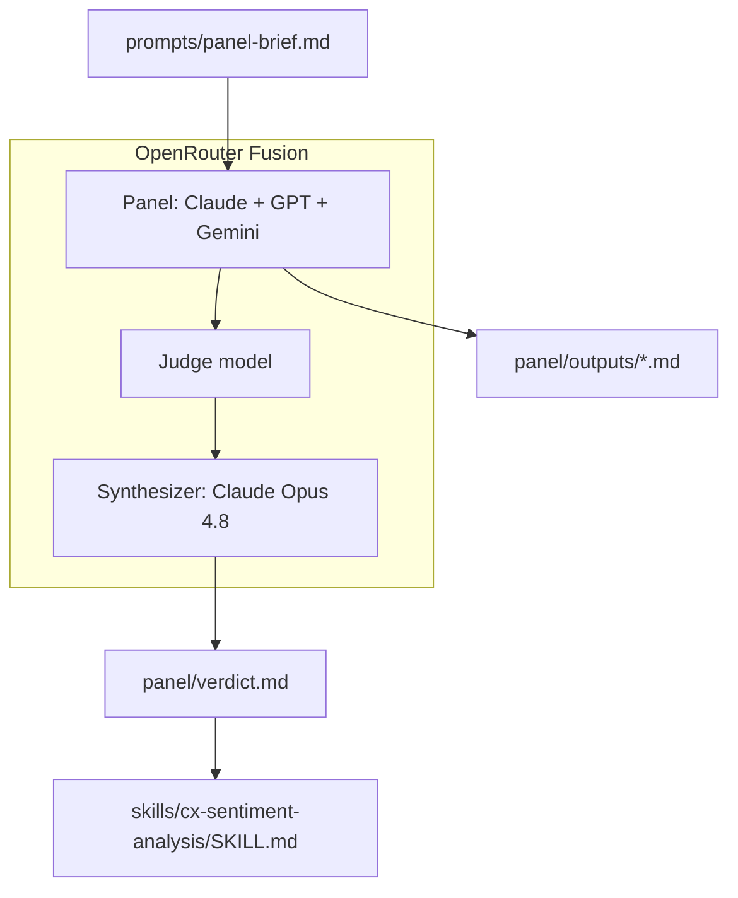

# Agent Council CX Sentiment Skill

**AI Agent Council POC:** stress-testing a SaaS support sentiment rubric with [OpenRouter Fusion](https://openrouter.ai/docs/guides/routing/routers/fusion-router).

Single-model review is one opinion — even when the model is the best in the world. This repository documents a proof-of-concept where the same expert-panel brief was sent to three frontier models in parallel (Claude Opus, GPT, Gemini Pro), a judge surfaced the structure of their disagreement, and a synthesizer merged the best ideas into a portable agent skill.

The canonical single-score sentiment design would rate a polite customer during a total production outage as **5/5** and route them away from retention. Every model on the council caught that flaw. The disagreement on *architecture* — while agreeing on the obvious — is the deliberation that earned the verdict.

---

## Repository layout

```
agent-council-cx-sentiment-skill/
├── README.md
├── LICENSE
│
├── skills/                                 ← portable skills (copy to agent)
│   ├── README.md
│   └── cx-sentiment-analysis/
│       ├── SKILL.md                        ← main rubric (§1–§14)
│       └── reference.md                    ← provenance, stress tests
│
├── panel/                                  ← how the skill was built
│   ├── README.md
│   ├── outputs/                            ← raw panel model responses
│   ├── verdict.md                          ← Fusion synthesizer output
│   ├── comparative-review.md               ← which model won
│   └── production-roadmap.md               ← path to production
│
├── prompts/
│   └── panel-brief.md                      ← rerun the council
│
└── docs/
    ├── article.md                          ← LinkedIn article
    └── linkedin-post.md                    ← short teaser
```

---

## Quick start — use the skill

Skills live at [`skills/cx-sentiment-analysis/`](skills/cx-sentiment-analysis/). Copy into your agent's skills directory:

```bash
# Cursor (project)
mkdir -p .cursor/skills && cp -r skills/cx-sentiment-analysis .cursor/skills/

# Claude Code (project)
mkdir -p .claude/skills && cp -r skills/cx-sentiment-analysis .claude/skills/
```

Invoke by name: **`cx-sentiment-analysis`** when analyzing support tickets.

Full install options (global paths, both agents): [`skills/README.md`](skills/README.md)

> **Disclaimer:** v1.0 **candidate, not production-validated**. See [panel/production-roadmap.md](panel/production-roadmap.md) before deploying.

---

## What each folder is for

| Path | Purpose |
|---|---|
| [`skills/cx-sentiment-analysis/`](skills/cx-sentiment-analysis/) | **The deliverable** — portable Cursor/Claude agent skill |
| [`skills/README.md`](skills/README.md) | Install commands for `.cursor/skills/` and `.claude/skills/` |
| [`panel/outputs/`](panel/outputs/) | Raw independent outputs from each panel model |
| [`panel/verdict.md`](panel/verdict.md) | Fusion synthesizer final verdict |
| [`panel/comparative-review.md`](panel/comparative-review.md) | Which model "won" and why |
| [`panel/production-roadmap.md`](panel/production-roadmap.md) | Phased plan to take the skill to production |
| [`prompts/panel-brief.md`](prompts/panel-brief.md) | Reproducible panel prompt |
| [`docs/article.md`](docs/article.md) | Full LinkedIn article draft |

---

## Architecture



**Flow:** panel → judge → synthesizer → verdict → skill

---

## Key finding

All three models agreed on the headline flaw: canonical sentiment scoring **conflates emotional valence, satisfaction, business impact, and churn risk** into one number.

They disagreed on architecture — and that disagreement was the value:

| Criterion | Claude Opus | GPT Latest | Gemini Pro |
|---|---|---|---|
| Determinism | Strong | **Strongest** | Weak |
| Auditability | Strong | **Strongest** | Good |
| Governance (α target) | **Best** | Gap | Gap |
| Worked JSON examples | Few | **5 full** | Schema only |
| Brevity / elegance | Medium | Verbose | **Best** |

The final skill synthesizes GPT's precedence-and-caps scoring engine with Claude's governance scaffolding (Krippendorff's α ≥ 0.80, determinism controls) and Gemini's P1-outage baseline guardrail. See [`panel/comparative-review.md`](panel/comparative-review.md).

---

## How to reproduce the council

1. Copy the prompt from [`prompts/panel-brief.md`](prompts/panel-brief.md)
2. Run it through [OpenRouter Fusion](https://openrouter.ai/docs/guides/routing/routers/fusion-router) with at least three panel models
3. Add a judge step and synthesizer (see [`panel/README.md`](panel/README.md))
4. Optionally run the follow-up prompts for comparative review and production roadmap

---

## LinkedIn article

Full narrative, cost-conscious variant, and reproduction guide: [`docs/article.md`](docs/article.md)

---

## License

MIT — see [LICENSE](LICENSE).

---

## References

- [OpenRouter Fusion: Surpassing Frontier Performance](https://openrouter.ai/blog/announcements/fusion-beats-frontier/)
- [OpenRouter Fusion Router docs](https://openrouter.ai/docs/guides/routing/routers/fusion-router)
- [AI Agent Council skill (MCP Market)](https://mcpmarket.com/tools/skills/ai-agent-council)
- [Agent Skills overview (Claude)](https://platform.claude.com/docs/en/agents-and-tools/agent-skills/overview)
- Talk Isn't Always Cheap: Understanding Failure Modes in Multi-Agent Debate ([arXiv 2509.05396](https://arxiv.org/abs/2509.05396))
