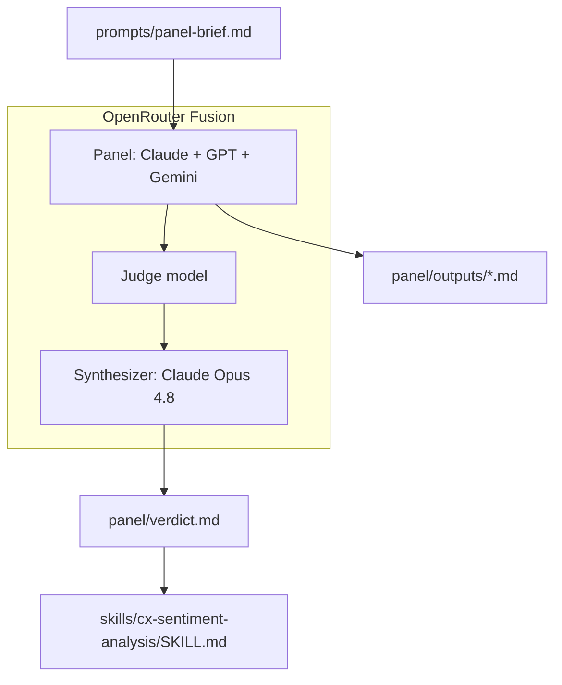
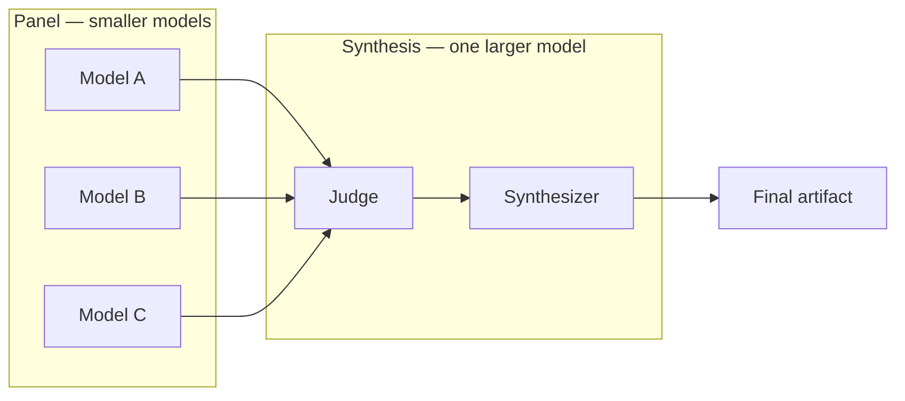

# Agent Council CX Sentiment Skill

**AI Agent Council POC:** stress-testing a SaaS support sentiment rubric with [OpenRouter Fusion](https://openrouter.ai/docs/guides/routing/routers/fusion-router).

Single-model review is one opinion — even when the model is the best in the world. This repository documents a proof-of-concept where the same expert-panel brief was sent to three frontier models in parallel (Claude Opus, GPT, Gemini Pro), a judge surfaced the structure of their disagreement, and a synthesizer merged the best ideas into a portable agent skill.

The broader idea: **latest models on every call are expensive**, and one flagship alone still has blind spots. A cost-efficient alternative — several smaller models for parallel planning, one larger model to fuse the results — can deliver **better deliberation at lower cost** than a single expensive run. OpenRouter's published Fusion benchmarks support that pattern directionally; this POC demonstrates it on a real design-review task. See [Why fuse instead of one flagship model?](#why-fuse-instead-of-one-flagship-model) for the economics, evidence, and disclaimers.

The canonical single-score sentiment design would rate a polite customer during a total production outage as **5/5** and route them away from retention. Every model on the council caught that flaw. The disagreement on *architecture* — while agreeing on the obvious — is the deliberation that earned the verdict.

---

## Repository layout

```
agent-council-cx-sentiment-skill/
├── README.md
├── LICENSE
│
├── skills/                                 ← portable skills (copy to agent)
│   ├── README.md
│   └── cx-sentiment-analysis/
│       ├── SKILL.md                        ← main rubric (§1–§14)
│       └── reference.md                    ← provenance, stress tests
│
├── panel/                                  ← how the skill was built
│   ├── README.md
│   ├── outputs/                            ← raw panel model responses
│   ├── verdict.md                          ← Fusion synthesizer output
│   ├── comparative-review.md               ← which model won
│   └── production-roadmap.md               ← path to production
│
├── prompts/
│   └── panel-brief.md                      ← rerun the council
│
└── docs/
    ├── article.md                          ← LinkedIn article
    └── linkedin-post.md                    ← short teaser
```

---

## Quick start — use the skill

Skills live at [`skills/cx-sentiment-analysis/`](skills/cx-sentiment-analysis/). Copy into your agent's skills directory:

```bash
# Cursor (project)
mkdir -p .cursor/skills && cp -r skills/cx-sentiment-analysis .cursor/skills/

# Claude Code (project)
mkdir -p .claude/skills && cp -r skills/cx-sentiment-analysis .claude/skills/
```

Invoke by name: **`cx-sentiment-analysis`** when analyzing support tickets.

Full install options (global paths, both agents): [`skills/README.md`](skills/README.md)

> **Skill disclaimer:** v1.0 **candidate, not production-validated**. See [panel/production-roadmap.md](panel/production-roadmap.md) before deploying. For council / Fusion pattern disclaimers, see [Why fuse instead of one flagship model?](#why-fuse-instead-of-one-flagship-model) below.

---

## What each folder is for

| Path | Purpose |
|---|---|
| [`skills/cx-sentiment-analysis/`](skills/cx-sentiment-analysis/) | **The deliverable** — portable Cursor/Claude agent skill |
| [`skills/README.md`](skills/README.md) | Install commands for `.cursor/skills/` and `.claude/skills/` |
| [`panel/outputs/`](panel/outputs/) | Raw independent outputs from each panel model |
| [`panel/verdict.md`](panel/verdict.md) | Fusion synthesizer final verdict |
| [`panel/comparative-review.md`](panel/comparative-review.md) | Which model "won" and why |
| [`panel/production-roadmap.md`](panel/production-roadmap.md) | Phased plan to take the skill to production |
| [`prompts/panel-brief.md`](prompts/panel-brief.md) | Reproducible panel prompt |
| [`docs/article.md`](docs/article.md) | Full LinkedIn article draft |

---

## Architecture



**Flow:** panel → judge → synthesizer → verdict → skill

---

## Why fuse instead of one flagship model?

Running the latest frontier models for every planning and review task adds up fast. A single Opus-class call on a dense design brief can cost several times more than a flash-tier model — and you still get **one perspective**, with one model's blind spots baked into the answer.

The pattern this repo demonstrates — and the pattern OpenRouter built Fusion to support — flips the economics:

| Stage | Model tier | Job |
|---|---|---|
| **Panel** | Smaller / cheaper models (3–5, from different providers) | Independent planning, critique, and exploration in parallel |
| **Judge** | Mid-tier or same as synthesizer | Structure the disagreement: consensus, contradictions, gaps, blind spots |
| **Synthesizer** | Larger / frontier model | Read all panel outputs and **fuse** them into one final artifact |

You spend inference budget on **breadth** during planning (many cheap runs) and **depth** only once, at synthesis — where a bigger model weighs trade-offs across the full deliberation. That is often a better use of budget than one expensive monologue from a single flagship.

### What the research shows

OpenRouter published benchmark results on the [DRACO deep-research suite](https://openrouter.ai/blog/announcements/fusion-beats-frontier/) (100 tasks across 10 domains — reasoning, tool use, synthesis, citation quality). Highlights relevant to this pattern:

| Configuration | DRACO score | Notes |
|---|---|---|
| Claude Fable 5 (solo frontier) | 65.3% | Strongest individual model tested |
| Fable 5 + GPT-5.5 → fused by Opus 4.8 | **69.0%** | Beats any solo model |
| Gemini 3 Flash + Kimi K2.6 + DeepSeek V4 Pro → fused by Opus 4.8 | **64.7%** | **~50% of Fable 5 cost**, within ~1% of solo Fable score |
| Opus 4.8 (solo) | 58.8% | One frontier model alone |

Three takeaways from that work:

1. **Fusion can beat a single frontier model** — not by making each panel member smarter, but by combining diverse outputs and synthesizing them well.
2. **A budget panel can rival frontier solo performance** — Gemini 3 Flash, Kimi K2.6, and DeepSeek V4 Pro together (fused by Opus 4.8) outscored solo GPT-5.5 and solo Opus 4.8, at roughly half the cost of solo Fable 5.
3. **Synthesis itself adds lift** — fusing Opus 4.8 with itself (+6.7 points over solo Opus) suggests the merge step is load-bearing, not just the panel diversity.

Multi-agent research aligns directionally: [Talk Isn't Always Cheap](https://arxiv.org/abs/2509.05396) (arXiv 2509.05396) documents failure modes in multi-agent debate — redundancy, sycophancy, coordination overhead — which is why a structured **judge → synthesizer** step matters, not just "run more models and hope."

### Premium vs cost-efficient council

**This POC used a premium panel** (Claude Opus Latest, GPT Latest, Gemini Pro Latest) to stress-test the idea with maximum critique depth. That is the expensive tier — useful for high-stakes design reviews where missing a flaw is costlier than the inference bill.

**The cost-efficient tier** — the one the benchmarks support — looks like:

1. Send the same expert brief to **3–5 smaller models** from different providers (e.g. flash / mid-tier, not all flagships).
2. Run a **judge** pass to surface structured disagreement (does not need to be the largest model; needs a clean context window).
3. Use a **frontier synthesizer** (e.g. Opus 4.8) to write the final merged artifact.

Same architecture as this repo. Different price point. The disagreement is still the value; you do not need three flagships to get deliberation — you need **independent perspectives** and a synthesizer that can read them all.



---

## Disclaimers

**On the CX sentiment skill:** v1.0 **candidate, not production-validated**. It has not been calibrated against real ticket data. See [panel/production-roadmap.md](panel/production-roadmap.md) before deploying.

**On the council / Fusion pattern:**

- **This repo is a single POC**, not a controlled study. One test case (a `SKILL.md` design review), one panel run, one synthesizer. Results will vary by task, brief quality, model versions, and domain.
- **OpenRouter's DRACO benchmarks** measure deep-research tasks (reasoning + tools + citations), not rubric design or CX sentiment scoring. The cost-quality argument is **directionally supported** by their published numbers, not proven for your specific workflow until you run your own eval.
- **"Better than one model" is not guaranteed.** Multi-agent setups can add latency (Fusion panel runs are often 2–3× slower when invoked), cost (panel + judge + synthesizer tokens), and failure modes (models agreeing on the wrong answer, judge missing a key dissent, synthesizer smoothing over important disagreement). The judge and synthesizer steps exist to mitigate that — they do not eliminate it.
- **Model names and prices change.** Flash, Kimi, DeepSeek, Fable, and Opus versions referenced in benchmarks and this POC will be superseded. Re-benchmark when you change panel composition or model versions.
- **Not a drop-in for all tasks.** OpenRouter notes Fusion is not a universal replacement for frontier models — especially for long-horizon coding or tasks where a single fast model is sufficient. Use the council for decisions where a missed blind spot is expensive (architecture, rubrics, policies, specs) — not for every prompt.

---

## Key finding

All three models agreed on the headline flaw: canonical sentiment scoring **conflates emotional valence, satisfaction, business impact, and churn risk** into one number.

They disagreed on architecture — and that disagreement was the value:

| Criterion | Claude Opus | GPT Latest | Gemini Pro |
|---|---|---|---|
| Determinism | Strong | **Strongest** | Weak |
| Auditability | Strong | **Strongest** | Good |
| Governance (α target) | **Best** | Gap | Gap |
| Worked JSON examples | Few | **5 full** | Schema only |
| Brevity / elegance | Medium | Verbose | **Best** |

The final skill synthesizes GPT's precedence-and-caps scoring engine with Claude's governance scaffolding (Krippendorff's α ≥ 0.80, determinism controls) and Gemini's P1-outage baseline guardrail. See [`panel/comparative-review.md`](panel/comparative-review.md).

---

## How to reproduce the council

1. Copy the prompt from [`prompts/panel-brief.md`](prompts/panel-brief.md)
2. Run it through [OpenRouter Fusion](https://openrouter.ai/docs/guides/routing/routers/fusion-router) with at least three panel models
3. Add a judge step and synthesizer (see [`panel/README.md`](panel/README.md))
4. Optionally run the follow-up prompts for comparative review and production roadmap

---

## LinkedIn article

Full narrative, cost-conscious variant, and reproduction guide: [`docs/article.md`](docs/article.md)

---

## License

MIT — see [LICENSE](LICENSE).

---

## References

- [OpenRouter Fusion: Surpassing Frontier Performance](https://openrouter.ai/blog/announcements/fusion-beats-frontier/)
- [OpenRouter Fusion Router docs](https://openrouter.ai/docs/guides/routing/routers/fusion-router)
- [AI Agent Council skill (MCP Market)](https://mcpmarket.com/tools/skills/ai-agent-council)
- [Agent Skills overview (Claude)](https://platform.claude.com/docs/en/agents-and-tools/agent-skills/overview)
- Talk Isn't Always Cheap: Understanding Failure Modes in Multi-Agent Debate ([arXiv 2509.05396](https://arxiv.org/abs/2509.05396))
